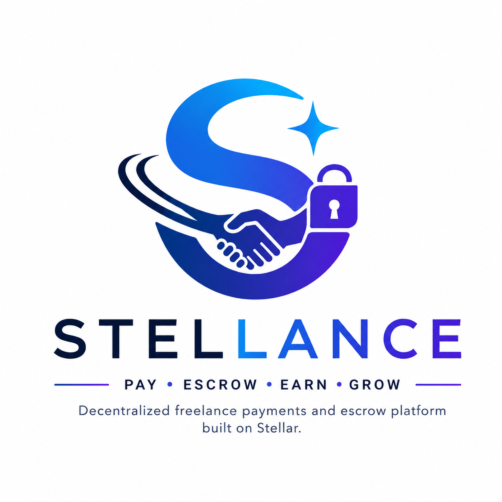

<div align="center">
  
  
  # Stellance
  
  **A Stellar-powered freelance payment marketplace for instant escrow and on-chain payouts.**

  [](https://github.com/alone-in/stellances/actions/workflows/ci.yml)
  [](LICENSE)
  [](https://stellar.org)
  [](CONTRIBUTING.md)
</div>

## Why Stellance Exists

The freelance economy is broken:

- Experts wait days or weeks to get paid for work delivered immediately
- Platforms take 20–30% commissions and lock up funds
- Clients must pay before value is confirmed
- Small jobs and milestones are inefficient and expensive

Stellance solves this by moving payments onto the Stellar network with trustless escrow and fast settlement.

## What Makes Stellance Different

Stellance is built around instant, on-chain payment delivery rather than delayed invoicing.

### Core Principles

- Pay only for completed work and approved milestones
- Escrow funds until value is delivered
- Keep fees low with Stellar transaction economics
- Make blockchain seamless for users

### How It Works

1. **Connect**
   - Freelancers and clients connect a Stellar wallet.
2. **Create job/contract**
   - Clients post jobs and hire freelancers with contract terms.
3. **Fund escrow**
   - Clients lock funds into an on-chain escrow flow.
4. **Deliver work**
   - Freelancers submit milestones or deliverables.
5. **Release payment**
   - Approved work triggers payment release to the freelancer.

## Why This Fits the Stellar Wave Program

Stellance is a natural fit for Stellar Wave because it:

- Uses Stellar and Horizon for low-fee, instant payment rails
- Implements escrow flows that map directly to real-world freelance payments
- Aligns with trustless, open payment infrastructure
- Demonstrates active work on frontend, backend, and blockchain integration
- Is designed for contributor engagement and active project growth on Drips

## Key Features

- Expert marketplace for freelance talent
- On-chain escrow for secure contract payment
- Fast settlement with XLM and Stellar assets
- Testnet demo and contributor-focused onboarding
- Open-source architecture for third-party integration

## Tech Stack

### Frontend
- Next.js
- React
- Tailwind CSS

### Backend
- Node.js + NestJS
- Prisma + PostgreSQL

### Blockchain
- Stellar network
- Horizon API
- Soroban smart contracts (in-repo: `stellance/Contracts/`)

### Wallet
- Stellar wallet integration (Freighter-ready)

## Repository Structure

```
stellances/                       # Root
├── stellance/
│   ├── backend/                  # NestJS API (auth, jobs, contracts, payments)
│   ├── frontend/                 # Next.js app (marketplace UI, Stellar demo)
│   └── Contracts/                # Soroban smart contracts (Rust)
├── .github/
│   ├── workflows/ci.yml          # CI: lint · test · coverage · contract build
│   ├── ISSUE_TEMPLATE/           # Contributor application templates
│   └── pull_request_template.md  # PR checklist
├── docs/                         # Project assets (logo)
├── CHANGELOG.md                  # Version history
├── CONTRIBUTING.md               # Architecture, data models, dev setup
├── SECURITY.md                   # Vulnerability disclosure policy
├── LICENSE                       # MIT
└── README.md                     # Project overview
```

## Project Status

Stellance is under active development.

Current focus:

- Frontend marketplace and demo pages
- Stellar escrow and payment flow
- Developer onboarding and contributor workflows
- Project documentation for the Stellar Wave community

## Documentation

| Document | Description |
|----------|-------------|
| [docs/architecture.md](docs/architecture.md) | Full system architecture — component map, layer breakdown, Soroban contract design, auth flow, key decisions |
| [docs/escrow-flow.md](docs/escrow-flow.md) | Escrow, milestone and dispute flows with state machines and sequence diagrams |
| [docs/api-reference.md](docs/api-reference.md) | Full API reference — request/response shapes, auth, error format |
| [docs/local-development.md](docs/local-development.md) | Local setup guide (backend, frontend, contracts, common issues) |
| [CONTRIBUTING.md](CONTRIBUTING.md) | Architecture overview, data models, user flows, how to pick and submit an issue |

## Getting Started

### Clone the repository

```bash
git clone https://github.com/alone-in/stellances.git
cd stellances
```

See [docs/local-development.md](docs/local-development.md) for the full setup guide including PostgreSQL options, environment variables, contract builds, and common troubleshooting.

### Backend setup (quick start)

```bash
cd stellance/backend
npm install
cp .env.example .env
# Edit .env — set DATABASE_URL and JWT_SECRET at minimum
npx prisma migrate dev
npm run start:dev
```

API runs at `http://localhost:3001/api` · Swagger docs at `http://localhost:3001/docs`

### Frontend setup

```bash
cd stellance/frontend
npm install
npm run dev
```

Open `http://localhost:3000` and visit `/demo` to try the Stellar testnet payment demo.

## Branching Strategy

Use one branch per change.

- `feat/` – new features
- `fix/` – bug fixes
- `refactor/` – code cleanup
- `docs/` – documentation updates

Examples:

- `feat/escrow-status`
- `fix/wallet-connection`
- `docs/add-demo-page`

## Before Submitting a PR

- Ensure the app builds without errors
- Verify no existing functionality is broken
- Make UI changes responsive
- Follow project conventions
- Include a clear PR description

## Communication

If you have questions:

- Open a GitHub issue
- Use the contributor issue templates in `.github/ISSUE_TEMPLATE`

## Code of Conduct

We are inclusive, respectful, and constructive.

- No harassment
- No gatekeeping
- Focus on collaboration

## License

This project is licensed under the MIT License.

## Security

To report a vulnerability, see [SECURITY.md](SECURITY.md).

## Changelog

See [CHANGELOG.md](CHANGELOG.md) for a history of notable changes.
